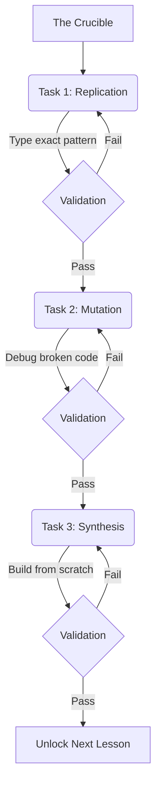

# RIOT_TRACE // GTSD Execution Engine

> **No passenger seats. Everything here is executed, evaluated, and earned.**

`riot-trace` is a hostile, high-stakes execution environment designed to permanently close the gap between AI-assisted code generation and absolute architectural sovereignty. It is not a passive tutorial platform; it is a curriculum matrix that forces the developer to deconstruct JavaScript, React, and System Architecture character by character.

---

## ⚙️ Core Architecture & Tech Stack

This platform abstracts away traditional databases, utilizing the physical file system and MDX to drive dynamic routing and curriculum state.

| Technology | Implementation |
| :--- | :--- |
| **Next.js 16 (App Router)** | Core framework, utilizing Promise-based dynamic routing (`await params`). |
| **TypeScript** | Strict type enforcement across components, APIs, and curriculum logic. |
| **MDX & Gray-Matter** | Markdown + JSX. The file system acts as the database; frontmatter holds validation logic. |
| **Tailwind CSS** | Custom styling engine optimized for a dark, industrial terminal aesthetic. |
| **LiveCodeRunner** | Custom client-side execution sandbox that intercepts `console.log` and evaluates user input. |

---

## 🧠 The 4-Layer Execution Model

Every lesson in the 112-lesson matrix strictly follows the 4-Layer format to bridge theoretical syntax with physical application.

1. **The Context:** Concepts are tied directly to real-world projects (`xandeum-pulse`, `riot-sop`). No abstract `foo/bar` variables.
2. **The Anatomy:** Forensic, character-by-character breakdown of the syntax.
3. **Micro-Drills:** Single-line, unassisted typing exercises to build raw muscle memory.
4. **The Crucible:** The gating mechanism. You cannot proceed without passing three execution tasks:



---

## 🗄️ The Curriculum Matrix

The progression is linear and uncompromising. No skipping. 

* **Tier 01: Code Literacy** — Primitives, Scope, Hoisting, Logic Gates, Arrays/Objects.
* **Tier 02: JavaScript Deeply** — Iteration, Closures, Method Chaining, Event Loop, Promises.
* **Tier 03: React (The Mental Model)** — VDOM, Immutability, Stale Closures, Context, Custom Hooks.
* **Tier 04: The Web Platform** — HTTP Protocols, REST/Fetch, Browser Storage, CORS, JWTs.
* **Tier 05: Databases & Backend** — Node.js, Relational DBs, Raw SQL, Prisma, Row Level Security.
* **Tier 06: CS Essentials** — Big-O, Hash Maps, Pointers, Graph Theory (External LeetCode/CodeWars validation).
* **Tier 07: System Design** — Microservices, Caching (Redis), WebSockets, Load Balancing.

---

## 💰 The Deflationary XP Economy

The platform tracks progress through a mathematically finite XP system capped at **139,720 XP**. 

| Action / Milestone | XP Awarded |
| :--- | :--- |
| **Theory Read** | +10 XP |
| **Micro-Drill Success** | +25 XP |
| **Crucible: Task 1 (Rep)** | +50 XP |
| **Crucible: Task 2 (Mut)** | +150 XP |
| **Crucible: Task 3 (Syn)** | +300 XP |
| **Module Boss Fight** | +1,500 XP |
| **Tier Capstone** | +5,000 XP |

⚠️ **The Decay Mechanic:** To enforce discipline and maintain muscle memory, any lesson left unreviewed for 48 hours incurs a penalty of **-15 XP per day** until reviewed.

---

## 📂 Project Structure & Routing

To resolve dynamic routing overlaps in Next.js 16, the URL paths and the file system paths are deliberately decoupled. The URL remains clean (`/tier/1/lesson/01`), while the custom `curriculum.ts` engine scans the `module-XX` directories under the hood.

```text
riot-trace/
├── src/
│   ├── app/
│   │   └── tier/
│   │       └── [tierId]/
│   │           ├── page.tsx                 # Module Ledger (List of Lessons)
│   │           └── lesson/
│   │               └── [lessonId]/
│   │                   └── page.tsx         # The Live Lesson Runner
│   ├── components/
│   │   └── LiveCodeRunner.tsx               # The Client-Side Execution Sandbox
│   ├── curriculum/                          # The "Database"
│   │   └── tier-01/
│   │       ├── module-01/
│   │       │   ├── lesson-01.mdx            
│   │       │   └── boss-01.mdx              
│   │       └── module-02/
│   └── lib/
│       └── curriculum.ts                    # File-system scanning & MDX parsing
```

---

## 🚀 Installation & Local Deployment

### Prerequisites
* Node.js 18.17+ 
* npm or pnpm

### Setup
1. **Clone the repository:**
   ```bash
   git clone [https://github.com/Idle0x/riot-trace.git](https://github.com/Idle0x/riot-trace.git)
   cd riot-trace
   ```

2. **Install dependencies:**
   ```bash
   npm install
   ```

3. **Initialize the engine:**
   ```bash
   npm run dev
   ```

4. **Access the Matrix:**
   Navigate to `http://localhost:3000` in your browser. 

*Note: Progress is currently persisted via highly serialized `localStorage`. Clearing your browser cache will wipe your execution state and XP balance.*

---

## 🛠️ Roadmap & Future Capabilities

* **WebAssembly (Wasm) Backend Emulation:** For Tier 05 (Databases), integration of WebContainers to run isolated Node.js and SQLite environments directly in the browser.
* **AST Validation:** Upgrading the `LiveCodeRunner` from string/regex validation to Abstract Syntax Tree (AST) parsing via Babel, ensuring the user *how* a problem was solved, not just checking the `console.log` output.
* **External API Verification:** Live pinging of LeetCode and CodeWars APIs to automatically verify Tier 06 algorithmic completions.

---
*Developed for the Sovereign Developer.*
